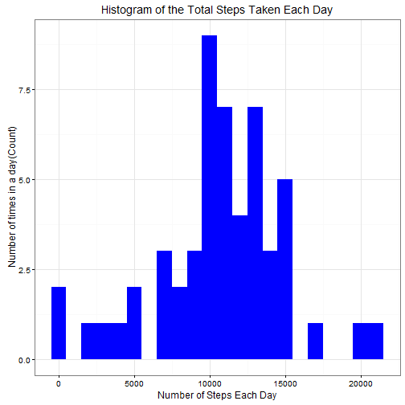
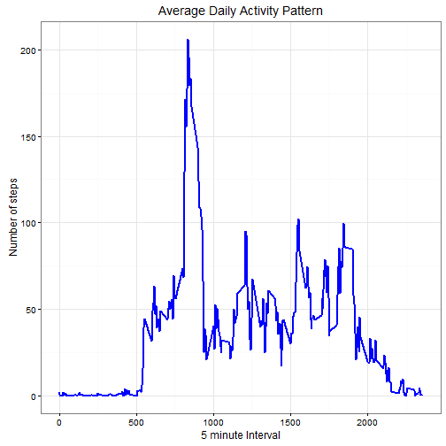
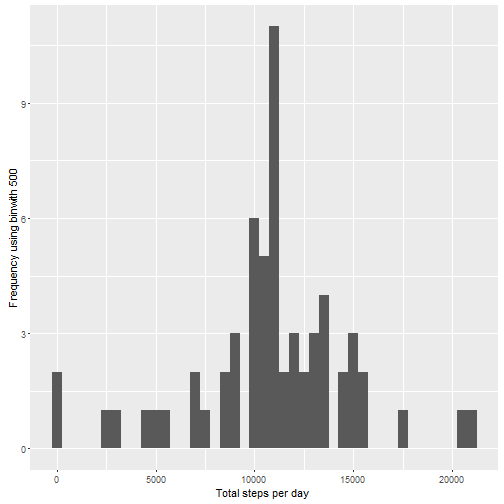
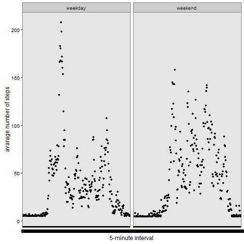

#Reproducible Research : Peer Assessment 1


```r
library(ggplot2) 
library(scales)
library(Hmisc)
```


### Load and preprocess the data 
#### 1. Load the data (read.csv())

```r
if (!file.exists('activity.csv')) {
  unzip('activity.zip')
}
activityData <- read.csv('activity.csv')
```
#### 2.Process the raw data 

```r
activityData$date <- as.Date(activityData$date, format = "%Y-%m-%d")
activityData$interval <- as.factor(activityData$interval)
```
#### 3.Check the Data

```r
str(activityData)
```

```
## 'data.frame':	17568 obs. of  3 variables:
##  $ steps   : int  NA NA NA NA NA NA NA NA NA NA ...
##  $ date    : Date, format: "2012-10-01" "2012-10-01" ...
##  $ interval: Factor w/ 288 levels "0","5","10","15",..: 1 2 3 4 5 6 7 8 9 10 ...
```
### What is the mean Total number of steps taken per day?

```r
###calculate the steps per day
steps_per_day <- aggregate(steps ~ date, activityData, sum)
colnames(steps_per_day) <- c("date","steps")
head(steps_per_day)
```

```
##         date steps
## 1 2012-10-02   126
## 2 2012-10-03 11352
## 3 2012-10-04 12116
## 4 2012-10-05 13294
## 5 2012-10-06 15420
## 6 2012-10-07 11015
```

```r
###Histogram of the total number of steps taken each day
ggplot(steps_per_day, aes(x = steps)) + 
       geom_histogram(fill = "blue", binwidth   = 1000) + 
        labs(title="Histogram of the Total Steps Taken Each Day", 
             x = "Number of Steps Each Day", y = "Number of times in a day(Count)") + theme_bw() 
```



```r
### Mean and median number of steps taken each day
steps_mean   <- mean(steps_per_day$steps, na.rm=TRUE)
steps_median <- median(steps_per_day$steps, na.rm=TRUE)
```

#### The Mean is : 1.0766189 &times; 10<sup>4</sup> and Median is : 10765

Time series plot of the average number of steps taken

```r
###calculate the aggregation of steps by intervals of 5-minutes
steps_per_interval <- aggregate(activityData$steps, 
                                by = list(interval = activityData$interval),
                                FUN=mean, na.rm=TRUE)
###convert to integers
steps_per_interval$interval <- 
        as.integer(levels(steps_per_interval$interval)[steps_per_interval$interval])
colnames(steps_per_interval) <- c("interval", "steps")

###Plot with the time series of the average numbers of taken across all the days 
ggplot(steps_per_interval, aes(x=interval, y=steps)) +   
        geom_line(color="blue", size=1) +  
        labs(title="Average Daily Activity Pattern", x="5 minute Interval", y="Number of steps") +  
        theme_bw()
```



##The 5-minute interval that, on average, contains the maximum number of steps

```r
max_interval <- steps_per_interval[which.max(steps_per_interval$steps),]
colnames(max_interval) <- c("interval","steps")
```
#### The 835 interval has maximum  206.1698113 steps 

Imputing missing values
 1. The total number of missing values in the dataset

```r
missing_values <- sum(is.na(activityData$steps))
```
The total number of missing values are 2304

2. strategy for filling in all of the missing values in the dataset.
3. Create new dataset that is equal to the original dataset but with the missing data filled in.

```r
activity_data_imputed <- activityData
activity_data_imputed$steps <- impute(activityData$steps, fun=mean)
```
#### 4. Plot histogram of the total number of steps taken each day

```r
steps_by_day_imputed <- tapply(activity_data_imputed$steps, activity_data_imputed$date, sum)
qplot(steps_by_day_imputed, xlab='Total steps per day ', ylab='Frequency using binwith 500', binwidth=500)
```


#### Calculate and report the mean and median total number of steps taken per day

```r
steps_by_mean_imputed <- mean(steps_by_day_imputed)
steps_by_median_imputed <- median(steps_by_day_imputed)
```
#### Mean : 1.0766189 &times; 10<sup>4</sup> and Median : 1.0766189 &times; 10<sup>4</sup>

Are there differences in activity patterns between weekdays and weekends?
1. Create a new factor variable in the dataset with two levels - "weekday" and "weekend" indicating whether a given date is a weekday or weekend day.

```r
activity_data_imputed$wtype <-  ifelse(as.POSIXlt(activity_data_imputed$date)$wday %in% c(0,6), 'weekend', 'weekday')
```
#### Make a time series plot

```r
average_activity_data_imputed <- aggregate(steps ~ interval + wtype, data=activity_data_imputed, mean)
ggplot(average_activity_data_imputed, aes(x=interval, y=steps)) + 
    geom_point() + 
    facet_wrap(~ wtype ) +
    xlab("5-minute interval") + 
    ylab("avarage number of steps") +
    theme_bw()
```


